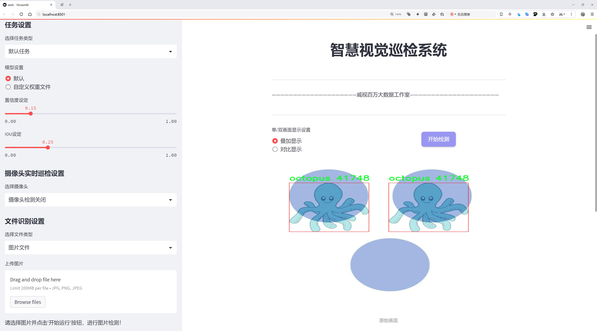
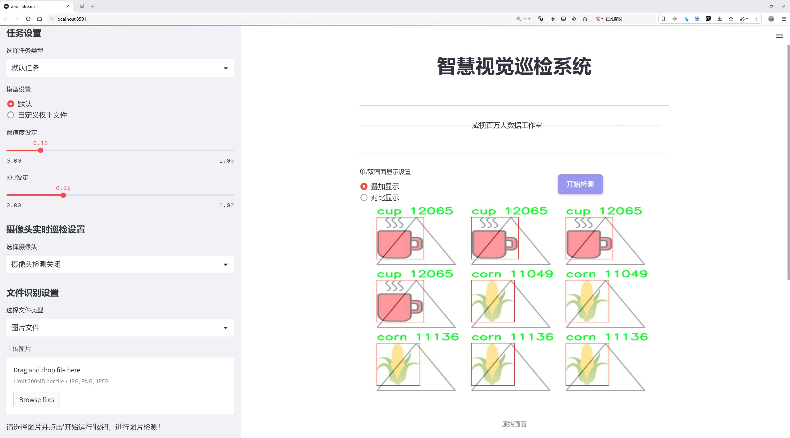
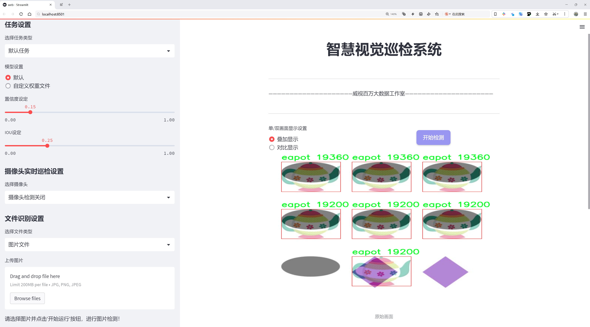
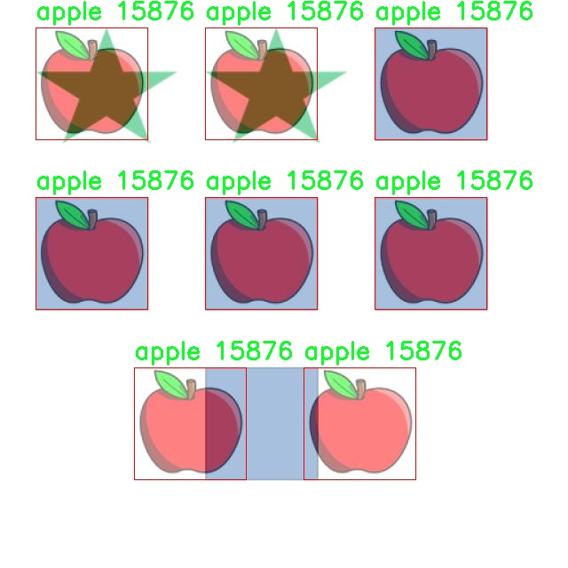
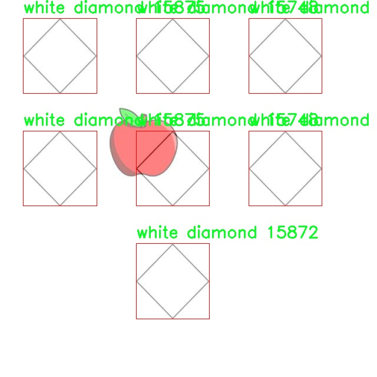
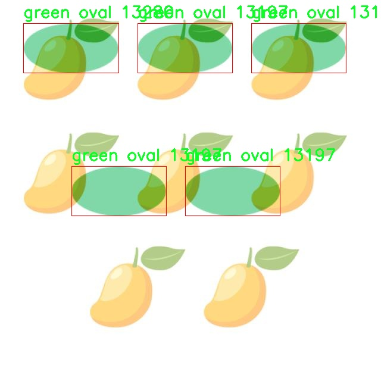
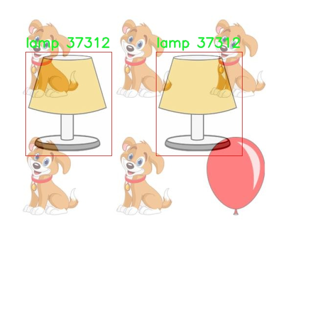
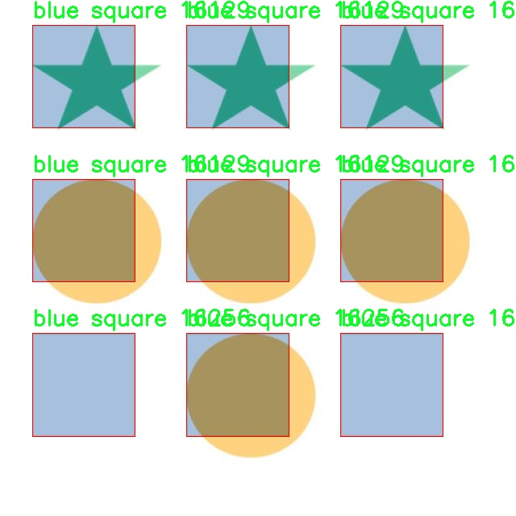

# 儿童动画标记检测检测系统源码分享
 # [一条龙教学YOLOV8标注好的数据集一键训练_70+全套改进创新点发刊_Web前端展示]

### 1.研究背景与意义

项目参考[AAAI Association for the Advancement of Artificial Intelligence](https://gitee.com/qunshansj/projects)

项目来源[AACV Association for the Advancement of Computer Vision](https://gitee.com/qunmasj/projects)

研究背景与意义

随着信息技术的迅猛发展，计算机视觉领域的研究日益受到关注，尤其是在物体检测和识别方面。儿童动画作为一种重要的文化产品，不仅在娱乐方面具有广泛的影响力，还在教育和心理发展中扮演着不可或缺的角色。近年来，儿童动画的数量不断增加，内容日益丰富，涉及的主题和角色种类繁多，这为动画内容的分析和理解提供了新的挑战和机遇。因此，开发一种高效的儿童动画标记检测系统显得尤为重要。

YOLO（You Only Look Once）系列模型因其高效的实时物体检测能力而受到广泛应用。YOLOv8作为该系列的最新版本，结合了深度学习的先进技术，具备了更强的特征提取和分类能力。通过对YOLOv8的改进，可以进一步提升其在儿童动画场景中的检测精度和速度，使其能够准确识别和标记出动画中的各种角色和物体。这一研究不仅有助于推动计算机视觉技术的发展，也为儿童动画的内容分析、分类和推荐系统提供了技术支持。

本研究将利用包含4992张图像和117个类别的Captcha3数据集，进行儿童动画标记检测系统的构建。该数据集涵盖了丰富的物体类别，包括动物、植物、日常用品等，能够为模型的训练提供多样化的样本。这些类别的多样性不仅反映了儿童动画中常见的元素，也为模型的泛化能力提供了良好的基础。通过对这些类别的深入学习，模型能够在实际应用中更好地适应不同风格和主题的儿童动画。

在实际应用中，儿童动画标记检测系统可以为教育机构、家长和内容创作者提供重要的支持。通过自动化的标记和分类，教育机构可以更有效地筛选和推荐适合不同年龄段儿童的动画内容，帮助他们在娱乐中获得知识和技能。同时，家长也可以借助该系统了解孩子观看的动画内容，从而更好地引导孩子的观看习惯。此外，内容创作者可以利用该系统分析观众的偏好，优化动画的制作和传播策略。

综上所述，基于改进YOLOv8的儿童动画标记检测系统的研究，不仅具有重要的学术价值，还在实际应用中展现出广泛的前景。通过提高儿童动画内容的识别和分析能力，能够为儿童的成长和教育提供更为丰富的资源和支持。这一研究的开展，将为计算机视觉技术在儿童教育领域的应用开辟新的方向，同时也为相关领域的研究提供新的思路和方法。

### 2.图片演示







##### 注意：由于此博客编辑较早，上面“2.图片演示”和“3.视频演示”展示的系统图片或者视频可能为老版本，新版本在老版本的基础上升级如下：（实际效果以升级的新版本为准）

  （1）适配了YOLOV8的“目标检测”模型和“实例分割”模型，通过加载相应的权重（.pt）文件即可自适应加载模型。

  （2）支持“图片识别”、“视频识别”、“摄像头实时识别”三种识别模式。

  （3）支持“图片识别”、“视频识别”、“摄像头实时识别”三种识别结果保存导出，解决手动导出（容易卡顿出现爆内存）存在的问题，识别完自动保存结果并导出到tempDir中。

  （4）支持Web前端系统中的标题、背景图等自定义修改，后面提供修改教程。

  另外本项目提供训练的数据集和训练教程,暂不提供权重文件（best.pt）,需要您按照教程进行训练后实现图片演示和Web前端界面演示的效果。

### 3.视频演示

[3.1 视频演示](https://www.bilibili.com/video/BV1qU4peXE7z/)

### 4.数据集信息展示

##### 4.1 本项目数据集详细数据（类别数＆类别名）

nc: 117
names: ['ant', 'apple', 'ball', 'balloon', 'banana', 'bell', 'bird', 'black circle', 'black diamond', 'black oval', 'black rectangle', 'black square', 'black star', 'black triangle', 'blue circle', 'blue diamond', 'blue oval', 'blue rectangle', 'blue square', 'blue star', 'blue triangle', 'brown circle', 'brown diamond', 'brown oval', 'brown rectangle', 'brown square', 'brown star', 'brown triangle', 'butterfly', 'cap', 'car', 'carrot', 'caterpillar', 'corn', 'cow', 'cup', 'cupcake', 'dog', 'duck', 'eapot', 'elephant', 'fish', 'flower', 'frog', 'green circle', 'green diamond', 'green oval', 'green rectangle', 'green square', 'green star', 'green triangle', 'hut', 'icecream', 'ladybug', 'lamp', 'lion', 'lollipop', 'mango', 'octopus', 'orange', 'orange circle', 'orange diamond', 'orange oval', 'orange rectangle', 'orange square', 'orange star', 'orange triangle', 'owl', 'pencil', 'pig', 'pineapple', 'pink circle', 'pink diamond', 'pink oval', 'pink rectangle', 'pink square', 'pink star', 'pink triangle', 'pumpkin', 'purple circle', 'purple diamond', 'purple oval', 'purple rectangle', 'purple square', 'purple star', 'purple triangle', 'rabbit', 'red circle', 'red diamond', 'red oval', 'red rectangle', 'red square', 'red star', 'red triangle', 'shark', 'snake', 'spider', 'sun', 'teddy', 'top', 'tree', 'umbrella', 'white circle', 'white diamond', 'white oval', 'white rectangle', 'white square', 'white star', 'white triangle', 'yellow circle', 'yellow diamond', 'yellow oval', 'yellow rectangle', 'yellow square', 'yellow star', 'yellow triangle', 'zirafah']


##### 4.2 本项目数据集信息介绍

数据集信息展示

在本研究中，我们使用了名为“Captcha3”的数据集，以训练和改进YOLOv8的儿童动画标记检测系统。该数据集包含117个类别，涵盖了丰富多样的对象，旨在提升模型在儿童动画场景中的识别能力和准确性。数据集的设计考虑到了儿童视觉认知的特点，包含了多种颜色、形状和物体，能够有效地模拟儿童在日常生活中可能遇到的各种元素。

“Captcha3”数据集的类别列表极为广泛，从常见的动物到水果、玩具、日常用品，几乎涵盖了儿童生活中的所有重要元素。例如，数据集中包括了“ant”（蚂蚁）、“apple”（苹果）、“ball”（球）、“balloon”（气球）、“banana”（香蕉）等基本的物体，这些都是儿童早期学习和认知的重要组成部分。此外，数据集中还包含了多种形状和颜色的几何图形，如“black circle”（黑色圆形）、“blue triangle”（蓝色三角形）、“red square”（红色正方形）等，这些元素不仅丰富了数据集的多样性，也为模型的训练提供了更多的特征学习机会。

在儿童动画的背景下，数据集中的对象设计考虑到了吸引儿童注意力的因素。比如，数据集中有“butterfly”（蝴蝶）、“lion”（狮子）、“octopus”（章鱼）等生动的动物形象，以及“cupcake”（杯子蛋糕）、“icecream”（冰淇淋）等美味的食物，这些元素不仅能够引起儿童的兴趣，也能帮助他们在互动中学习和识别不同的物体。通过使用这些丰富的类别，YOLOv8模型能够在训练过程中学习到更为复杂的特征，从而在实际应用中实现更高的准确率和鲁棒性。

此外，数据集中的颜色和形状的多样性也为模型的训练提供了更为全面的挑战。例如，数据集中有“green star”（绿色星星）、“yellow triangle”（黄色三角形）、“purple rectangle”（紫色矩形）等多种组合，这些组合不仅增加了模型的学习难度，也使得模型在处理实际应用时能够更好地适应不同的视觉场景。通过这种方式，模型能够在儿童动画标记检测中表现出更强的适应性和准确性。

总的来说，“Captcha3”数据集为YOLOv8的儿童动画标记检测系统提供了一个丰富的训练基础。其多样的类别和生动的对象设计，不仅能够有效提升模型的识别能力，还能为儿童提供一个有趣且富有教育意义的互动体验。通过对该数据集的深入分析和应用，我们期望能够推动儿童动画标记检测技术的发展，为未来的教育和娱乐应用奠定坚实的基础。











### 5.全套项目环境部署视频教程（零基础手把手教学）

[5.1 环境部署教程链接（零基础手把手教学）](https://www.ixigua.com/7404473917358506534?logTag=c807d0cbc21c0ef59de5)


[5.2 安装Python虚拟环境创建和依赖库安装视频教程链接（零基础手把手教学）](https://www.ixigua.com/7404474678003106304?logTag=1f1041108cd1f708b01a)

### 6.手把手YOLOV8训练视频教程（零基础小白有手就能学会）

[6.1 手把手YOLOV8训练视频教程（零基础小白有手就能学会）](https://www.ixigua.com/7404477157818401292?logTag=d31a2dfd1983c9668658)

### 7.70+种全套YOLOV8创新点代码加载调参视频教程（一键加载写好的改进模型的配置文件）

[7.1 70+种全套YOLOV8创新点代码加载调参视频教程（一键加载写好的改进模型的配置文件）](https://www.ixigua.com/7404478314661806627?logTag=29066f8288e3f4eea3a4)

### 8.70+种全套YOLOV8创新点原理讲解（非科班也可以轻松写刊发刊，V10版本正在科研待更新）

由于篇幅限制，每个创新点的具体原理讲解就不一一展开，具体见下列网址中的创新点对应子项目的技术原理博客网址【Blog】：


[8.1 70+种全套YOLOV8创新点原理讲解链接](https://gitee.com/qunmasj/good)

### 9.系统功能展示（检测对象为举例，实际内容以本项目数据集为准）

图9.1.系统支持检测结果表格显示

  图9.2.系统支持置信度和IOU阈值手动调节

  图9.3.系统支持自定义加载权重文件best.pt(需要你通过步骤5中训练获得)

  图9.4.系统支持摄像头实时识别

  图9.5.系统支持图片识别

  图9.6.系统支持视频识别

  图9.7.系统支持识别结果文件自动保存

  图9.8.系统支持Excel导出检测结果数据


### 10.原始YOLOV8算法原理

原始YOLOv8算法原理

YOLOv8作为目标检测领域的最新突破，继承并发扬了YOLO系列模型的优良传统，展示了更为强大的性能和灵活性。自2015年YOLO模型首次提出以来，经过多次迭代，YOLOv8不仅在推理速度和检测精度上实现了显著提升，还在模型的可训练性和适应性方面进行了深入优化。这些改进使得YOLOv8成为当前业界最受欢迎的目标检测算法之一，广泛应用于各类计算机视觉任务中。

YOLOv8的网络结构由输入层、Backbone骨干网络、Neck颈部结构和Head头部结构四个主要部分组成。输入层负责对输入图像进行预处理，包括缩放、马赛克数据增强、自适应锚框计算等，以确保输入数据符合模型的要求。经过这一层的处理，图像将被转换为适合网络处理的格式。

在Backbone部分，YOLOv8采用了先进的卷积操作来提取图像特征。该部分的设计灵感来源于YOLOv7中的E-ELAN结构，通过C2f模块的引入，YOLOv8实现了更为丰富的特征提取能力。C2f模块通过跨层分支连接，增强了模型的梯度流，改善了特征学习的效果。具体而言，C2f模块不仅能够捕捉到低层次的细节特征，还能有效地整合高层次的语义信息，从而提升了目标检测的准确性。此外，Backbone的末尾引入了SPPFl（Spatial Pyramid Pooling Fusion）模块，该模块通过多个最大池化层的组合，增强了网络对多尺度特征的处理能力，使得模型在面对不同尺寸的目标时，依然能够保持良好的检测性能。

Neck部分则负责特征的融合与传递。YOLOv8采用了路径聚合网络（PAN）结构，这一设计旨在有效整合来自不同尺度的特征图信息。通过FPNS（Feature Pyramid Network）和PAN的结合，YOLOv8能够在不同层次之间进行信息的高效传递，确保在目标检测过程中，模型能够充分利用各个层次的特征，从而提升最终的检测效果。

在Head部分，YOLOv8实现了三个解耦的检测头，分别负责回归和分类任务。这一解耦设计的引入，使得模型在进行目标检测时，能够独立优化分类和回归的损失函数，从而提升整体性能。具体而言，YOLOv8采用了Task-Aligned Assigner策略，根据分类与回归的分数加权结果选择正样本，从而优化样本的分配。此外，分类分支使用了二元交叉熵损失（BCELoss），而回归分支则结合了分布焦点损失（DFLoss）和完全交并比损失（CIOULoss），进一步提升了模型对边界框预测的精确性。

值得一提的是，YOLOv8在设计上充分考虑了模型的轻量化与实时性。通过调整depth_factor和width_factor参数，用户可以根据具体应用场景的需求，灵活选择模型的深度和宽度，从而在保证检测精度的同时，控制模型的复杂度和推理速度。这种灵活性使得YOLOv8能够在多种硬件平台上高效运行，满足不同应用场景的需求。

总的来说，YOLOv8通过对Backbone、Neck和Head结构的精心设计与优化，实现了在目标检测任务中的卓越表现。其在特征提取、特征融合及损失计算等多个方面的创新，使得YOLOv8不仅在检测精度上超越了前代模型，更在推理速度和模型可训练性上达到了新的高度。这些特性使得YOLOv8在目标检测领域中占据了重要的地位，成为研究者和工程师们广泛采用的工具。随着YOLOv8的不断发展与应用，其在计算机视觉领域的影响力将愈加显著，为未来的研究与应用提供了强有力的支持。


### 11.项目核心源码讲解（再也不用担心看不懂代码逻辑）

#### 11.1 70+种YOLOv8算法改进源码大全和调试加载训练教程（非必要）\ultralytics\nn\backbone\convnextv2.py

以下是经过简化和注释的核心代码部分，保留了ConvNeXtV2模型的基本结构和功能。

```python
import torch
import torch.nn as nn
import torch.nn.functional as F

class LayerNorm(nn.Module):
    """ 自定义的LayerNorm层，支持两种数据格式：channels_last和channels_first。 """
    def __init__(self, normalized_shape, eps=1e-6, data_format="channels_last"):
        super().__init__()
        self.weight = nn.Parameter(torch.ones(normalized_shape))  # 权重参数
        self.bias = nn.Parameter(torch.zeros(normalized_shape))    # 偏置参数
        self.eps = eps
        self.data_format = data_format
        if self.data_format not in ["channels_last", "channels_first"]:
            raise NotImplementedError 
        self.normalized_shape = (normalized_shape, )
    
    def forward(self, x):
        """ 前向传播，执行LayerNorm操作。 """
        if self.data_format == "channels_last":
            return F.layer_norm(x, self.normalized_shape, self.weight, self.bias, self.eps)
        elif self.data_format == "channels_first":
            u = x.mean(1, keepdim=True)  # 计算均值
            s = (x - u).pow(2).mean(1, keepdim=True)  # 计算方差
            x = (x - u) / torch.sqrt(s + self.eps)  # 标准化
            x = self.weight[:, None, None] * x + self.bias[:, None, None]  # 应用权重和偏置
            return x

class Block(nn.Module):
    """ ConvNeXtV2的基本块。 """
    def __init__(self, dim):
        super().__init__()
        self.dwconv = nn.Conv2d(dim, dim, kernel_size=7, padding=3, groups=dim)  # 深度卷积
        self.norm = LayerNorm(dim, eps=1e-6)  # LayerNorm
        self.pwconv1 = nn.Linear(dim, 4 * dim)  # 1x1卷积
        self.act = nn.GELU()  # 激活函数
        self.pwconv2 = nn.Linear(4 * dim, dim)  # 1x1卷积

    def forward(self, x):
        """ 前向传播，执行Block的操作。 """
        input = x
        x = self.dwconv(x)  # 深度卷积
        x = x.permute(0, 2, 3, 1)  # 维度变换
        x = self.norm(x)  # 归一化
        x = self.pwconv1(x)  # 第一个1x1卷积
        x = self.act(x)  # 激活
        x = self.pwconv2(x)  # 第二个1x1卷积
        x = x.permute(0, 3, 1, 2)  # 恢复维度
        return input + x  # 残差连接

class ConvNeXtV2(nn.Module):
    """ ConvNeXt V2模型。 """
    def __init__(self, in_chans=3, num_classes=1000, depths=[3, 3, 9, 3], dims=[96, 192, 384, 768]):
        super().__init__()
        self.downsample_layers = nn.ModuleList()  # 下采样层
        stem = nn.Sequential(
            nn.Conv2d(in_chans, dims[0], kernel_size=4, stride=4),  # 初始卷积
            LayerNorm(dims[0], eps=1e-6, data_format="channels_first")
        )
        self.downsample_layers.append(stem)
        
        # 添加下采样层
        for i in range(3):
            downsample_layer = nn.Sequential(
                LayerNorm(dims[i], eps=1e-6, data_format="channels_first"),
                nn.Conv2d(dims[i], dims[i+1], kernel_size=2, stride=2),
            )
            self.downsample_layers.append(downsample_layer)

        self.stages = nn.ModuleList()  # 特征分辨率阶段
        for i in range(4):
            stage = nn.Sequential(
                *[Block(dim=dims[i]) for _ in range(depths[i])]  # 添加多个Block
            )
            self.stages.append(stage)

        self.norm = nn.LayerNorm(dims[-1], eps=1e-6)  # 最后的归一化层
        self.head = nn.Linear(dims[-1], num_classes)  # 分类头

    def forward(self, x):
        """ 前向传播，执行整个模型的操作。 """
        for i in range(4):
            x = self.downsample_layers[i](x)  # 下采样
            x = self.stages[i](x)  # 通过特征阶段
        return x  # 返回最终特征

# 定义不同规模的ConvNeXtV2模型
def convnextv2_tiny(weights='', **kwargs):
    model = ConvNeXtV2(depths=[3, 3, 9, 3], dims=[96, 192, 384, 768], **kwargs)
    return model

# 其他规模的模型定义可以类似地添加
```

### 代码说明：
1. **LayerNorm**: 自定义的层归一化实现，支持两种数据格式。
2. **Block**: ConvNeXtV2的基本构建块，包含深度卷积、归一化、激活和残差连接。
3. **ConvNeXtV2**: 主模型类，包含下采样层和多个Block的堆叠。
4. **forward**: 定义了模型的前向传播过程。

通过这种方式，代码的核心部分得以保留，并且每个部分的功能得到了详细的注释，便于理解。

这个文件是一个实现了ConvNeXt V2模型的PyTorch代码，主要用于计算机视觉任务。文件首先导入了必要的库，包括PyTorch和一些用于初始化的函数。接着定义了一些类和函数，用于构建和初始化ConvNeXt V2模型。

首先，定义了一个`LayerNorm`类，它实现了层归一化（Layer Normalization），支持两种数据格式：`channels_last`和`channels_first`。这个类的构造函数接收归一化的形状、一个小的常数`eps`以避免除零错误，以及数据格式。`forward`方法根据输入数据的格式执行相应的归一化操作。

接下来是`GRN`类，它实现了全局响应归一化（Global Response Normalization）层。该层通过计算输入的L2范数来进行归一化，并通过可学习的参数`gamma`和`beta`来调整输出。

然后是`Block`类，它是ConvNeXt V2的基本构建块。这个类包含一个深度可分离卷积层、层归一化、点卷积层、激活函数（GELU）和GRN层。`forward`方法定义了数据如何通过这些层进行处理，并且使用了随机深度（Drop Path）来增强模型的鲁棒性。

`ConvNeXtV2`类是整个模型的核心。它接收输入通道数、分类类别数、每个阶段的块数、特征维度、随机深度率和分类器的初始化缩放值。构造函数中首先定义了下采样层，使用卷积和层归一化逐步减少特征图的尺寸。接着定义了多个阶段，每个阶段由多个`Block`组成。最后，定义了一个最终的归一化层和分类头。

`update_weight`函数用于更新模型的权重，确保加载的权重与模型的结构匹配。接下来的多个函数（如`convnextv2_atto`、`convnextv2_femto`等）用于创建不同规模的ConvNeXt V2模型，并可以选择性地加载预训练权重。

整体而言，这个文件实现了ConvNeXt V2模型的结构，提供了多种不同规模的模型配置，并支持权重的加载与更新，适用于各种计算机视觉任务。

#### 11.2 70+种YOLOv8算法改进源码大全和调试加载训练教程（非必要）\ultralytics\nn\extra_modules\ops_dcnv3\setup.py

以下是代码中最核心的部分，并附上详细的中文注释：

```python
import os
import glob
import torch
from torch.utils.cpp_extension import CUDA_HOME, CppExtension, CUDAExtension
from setuptools import find_packages, setup

# 定义依赖的库
requirements = ["torch", "torchvision"]

def get_extensions():
    # 获取当前文件的目录
    this_dir = os.path.dirname(os.path.abspath(__file__))
    # 定义扩展源代码的目录
    extensions_dir = os.path.join(this_dir, "src")

    # 查找主文件和CPU、CUDA源文件
    main_file = glob.glob(os.path.join(extensions_dir, "*.cpp"))
    source_cpu = glob.glob(os.path.join(extensions_dir, "cpu", "*.cpp"))
    source_cuda = glob.glob(os.path.join(extensions_dir, "cuda", "*.cu"))

    # 将主文件和CPU源文件合并
    sources = main_file + source_cpu
    extension = CppExtension  # 默认使用 CppExtension
    extra_compile_args = {"cxx": []}  # 编译参数
    define_macros = []  # 宏定义

    # 检查CUDA是否可用
    if torch.cuda.is_available() and CUDA_HOME is not None:
        extension = CUDAExtension  # 使用 CUDAExtension
        sources += source_cuda  # 添加CUDA源文件
        define_macros += [("WITH_CUDA", None)]  # 定义宏
        extra_compile_args["nvcc"] = []  # CUDA编译参数
    else:
        raise NotImplementedError('Cuda is not available')  # 如果CUDA不可用，抛出异常

    # 为每个源文件添加完整路径
    sources = [os.path.join(extensions_dir, s) for s in sources]
    include_dirs = [extensions_dir]  # 包含目录

    # 创建扩展模块
    ext_modules = [
        extension(
            "DCNv3",  # 扩展模块名称
            sources,  # 源文件列表
            include_dirs=include_dirs,  # 包含目录
            define_macros=define_macros,  # 宏定义
            extra_compile_args=extra_compile_args,  # 编译参数
        )
    ]
    return ext_modules  # 返回扩展模块列表

# 设置包信息
setup(
    name="DCNv3",  # 包名称
    version="1.1",  # 版本号
    author="InternImage",  # 作者
    url="https://github.com/OpenGVLab/InternImage",  # 项目链接
    description="PyTorch Wrapper for CUDA Functions of DCNv3",  # 描述
    packages=find_packages(exclude=("configs", "tests")),  # 查找包，排除特定目录
    ext_modules=get_extensions(),  # 获取扩展模块
    cmdclass={"build_ext": torch.utils.cpp_extension.BuildExtension},  # 指定构建扩展的命令类
)
```

### 代码注释说明：
1. **导入必要的库**：导入操作系统、文件查找、PyTorch及其扩展工具、以及设置工具包的库。
2. **定义依赖**：指定需要的Python库（如torch和torchvision）。
3. **获取扩展函数**：定义一个函数来查找和配置C++和CUDA扩展模块。
4. **查找源文件**：使用`glob`模块查找指定目录下的C++和CUDA源文件。
5. **检查CUDA可用性**：如果CUDA可用，则配置CUDA扩展；否则抛出异常。
6. **构建扩展模块**：使用`setuptools`的`setup`函数来定义包的基本信息和扩展模块。

这个程序文件是一个用于设置和编译DCNv3（Deformable Convolutional Networks v3）扩展的Python脚本，主要依赖于PyTorch的C++扩展功能。文件开头包含版权信息和许可证声明，表明该代码遵循MIT许可证。

首先，程序导入了一些必要的模块，包括操作系统模块`os`、文件查找模块`glob`以及PyTorch相关的模块。接着，它从`torch.utils.cpp_extension`中导入了`CUDA_HOME`、`CppExtension`和`CUDAExtension`，这些都是用于编译C++和CUDA扩展的工具。

在`requirements`变量中，列出了该扩展所需的Python包，包括`torch`和`torchvision`。

接下来，定义了一个名为`get_extensions`的函数，该函数负责查找和配置要编译的源文件。首先，它获取当前文件的目录，并构建出扩展源代码的路径。然后，使用`glob`模块查找所有的C++源文件和CUDA源文件，分别存储在`main_file`、`source_cpu`和`source_cuda`中。

根据CUDA的可用性，程序决定使用`CppExtension`还是`CUDAExtension`。如果CUDA可用，程序将CUDA源文件添加到源列表中，并定义一个宏`WITH_CUDA`。如果CUDA不可用，程序将抛出一个`NotImplementedError`，提示用户CUDA不可用。

之后，程序将所有源文件的路径进行拼接，并设置包含目录。接着，创建一个扩展模块列表`ext_modules`，其中包含了要编译的DCNv3扩展的相关信息，包括名称、源文件、包含目录、宏定义和编译参数。

最后，使用`setuptools`的`setup`函数来配置包的基本信息，如名称、版本、作者、描述等，并调用`get_extensions`函数来获取扩展模块。同时，指定了构建扩展时使用的命令类为`torch.utils.cpp_extension.BuildExtension`。

总的来说，这个脚本的主要功能是为DCNv3的CUDA功能创建一个PyTorch的包装器，并提供了编译所需的配置。

#### 11.3 ui.py

```python
import sys
import subprocess

def run_script(script_path):
    """
    使用当前 Python 环境运行指定的脚本。

    Args:
        script_path (str): 要运行的脚本路径

    Returns:
        None
    """
    # 获取当前 Python 解释器的路径
    python_path = sys.executable

    # 构建运行命令
    command = f'"{python_path}" -m streamlit run "{script_path}"'

    # 执行命令
    result = subprocess.run(command, shell=True)
    if result.returncode != 0:
        print("脚本运行出错。")


# 实例化并运行应用
if __name__ == "__main__":
    # 指定您的脚本路径
    script_path = "web.py"  # 这里可以直接指定脚本路径

    # 运行脚本
    run_script(script_path)
```

### 代码核心部分及注释：

1. **导入模块**：
   ```python
   import sys
   import subprocess
   ```
   - `sys`模块用于访问与Python解释器相关的变量和函数，例如获取当前Python解释器的路径。
   - `subprocess`模块用于执行外部命令，可以创建新的进程、连接到它们的输入/输出/错误管道，并获取返回码。

2. **定义`run_script`函数**：
   ```python
   def run_script(script_path):
   ```
   - 该函数接受一个参数`script_path`，表示要运行的Python脚本的路径。

3. **获取当前Python解释器路径**：
   ```python
   python_path = sys.executable
   ```
   - 使用`sys.executable`获取当前Python解释器的完整路径，以便在后续命令中使用。

4. **构建运行命令**：
   ```python
   command = f'"{python_path}" -m streamlit run "{script_path}"'
   ```
   - 使用f-string格式化字符串，构建运行指定脚本的命令。这里使用`-m streamlit run`来运行Streamlit应用。

5. **执行命令**：
   ```python
   result = subprocess.run(command, shell=True)
   ```
   - 使用`subprocess.run`执行构建的命令。`shell=True`表示通过shell来执行命令。

6. **检查命令执行结果**：
   ```python
   if result.returncode != 0:
       print("脚本运行出错。")
   ```
   - 检查命令的返回码，如果不为0，表示脚本运行出错，打印错误信息。

7. **主程序入口**：
   ```python
   if __name__ == "__main__":
   ```
   - 确保只有在直接运行该脚本时才会执行以下代码块。

8. **指定脚本路径并运行**：
   ```python
   script_path = "web.py"  # 这里可以直接指定脚本路径
   run_script(script_path)
   ```
   - 指定要运行的脚本路径，并调用`run_script`函数来执行该脚本。

这个程序文件的主要功能是通过当前的 Python 环境来运行一个指定的脚本，具体来说是一个名为 `web.py` 的脚本。程序首先导入了必要的模块，包括 `sys`、`os` 和 `subprocess`，这些模块分别用于访问系统特性、处理文件路径和执行外部命令。

在 `run_script` 函数中，首先获取当前 Python 解释器的路径，这通过 `sys.executable` 实现。接着，构建一个命令字符串，这个命令会调用 `streamlit` 模块来运行指定的脚本。`streamlit` 是一个用于构建数据应用的流行库，命令的格式是 `python -m streamlit run script_path`，其中 `script_path` 是要运行的脚本的路径。

然后，使用 `subprocess.run` 方法来执行这个命令。`shell=True` 参数允许在 shell 中执行命令。执行完命令后，程序会检查返回码，如果返回码不为零，说明脚本运行过程中出现了错误，此时会打印出“脚本运行出错”的提示信息。

在文件的最后部分，使用 `if __name__ == "__main__":` 语句来确保只有在直接运行该文件时才会执行下面的代码。在这里，首先调用 `abs_path` 函数来获取 `web.py` 的绝对路径，然后调用 `run_script` 函数来运行这个脚本。

总体来说，这个程序的设计是为了方便用户在当前 Python 环境中运行一个 Streamlit 应用脚本，并且能够处理可能出现的错误。

#### 11.4 code\ultralytics\engine\tuner.py

以下是经过简化和注释的核心代码部分，主要保留了超参数调优的逻辑和方法。

```python
import random
import shutil
import subprocess
import time
import numpy as np
import torch
from ultralytics.cfg import get_cfg, get_save_dir
from ultralytics.utils import callbacks, LOGGER, yaml_save, yaml_print
from ultralytics.utils.plotting import plot_tune_results

class Tuner:
    """
    负责YOLO模型超参数调优的类。

    该类通过在给定的迭代次数内变异超参数，并重新训练模型来评估其性能。
    """

    def __init__(self, args):
        """
        初始化Tuner，配置超参数搜索空间。

        Args:
            args (dict): 超参数进化的配置。
        """
        # 定义超参数搜索空间，包含每个超参数的最小值、最大值和可选的增益
        self.space = {
            "lr0": (1e-5, 1e-1),  # 初始学习率
            "momentum": (0.7, 0.98, 0.3),  # 动量
            "weight_decay": (0.0, 0.001),  # 权重衰减
            # 其他超参数...
        }
        self.args = get_cfg(overrides=args)  # 获取配置
        self.tune_dir = get_save_dir(self.args, name="tune")  # 设置保存目录
        self.tune_csv = self.tune_dir / "tune_results.csv"  # CSV文件路径
        self.callbacks = callbacks.get_default_callbacks()  # 获取默认回调
        LOGGER.info(f"Initialized Tuner instance with 'tune_dir={self.tune_dir}'")

    def _mutate(self):
        """
        根据搜索空间变异超参数。

        Returns:
            dict: 包含变异后超参数的字典。
        """
        # 读取已有的超参数记录
        if self.tune_csv.exists():
            x = np.loadtxt(self.tune_csv, ndmin=2, delimiter=",", skiprows=1)
            fitness = x[:, 0]  # 获取适应度
            n = min(5, len(x))  # 选择前5个
            x = x[np.argsort(-fitness)][:n]  # 按适应度排序选择
            # 选择父代并进行变异
            x = x[random.choices(range(n), weights=fitness[:n])[0]]
            # 变异逻辑
            mutated_hyp = {k: float(x[i + 1]) for i, k in enumerate(self.space.keys())}
        else:
            mutated_hyp = {k: getattr(self.args, k) for k in self.space.keys()}

        # 限制超参数在指定范围内
        for k, v in self.space.items():
            mutated_hyp[k] = max(min(mutated_hyp[k], v[1]), v[0])  # 限制上下界
            mutated_hyp[k] = round(mutated_hyp[k], 5)  # 保留五位小数

        return mutated_hyp

    def __call__(self, model=None, iterations=10):
        """
        执行超参数进化过程。

        Args:
            model (Model): 预初始化的YOLO模型。
            iterations (int): 进化的代数。
        """
        for i in range(iterations):
            # 变异超参数
            mutated_hyp = self._mutate()
            LOGGER.info(f"Starting iteration {i + 1}/{iterations} with hyperparameters: {mutated_hyp}")

            # 训练模型并记录结果
            train_args = {**vars(self.args), **mutated_hyp}
            cmd = ["yolo", "train", *(f"{k}={v}" for k, v in train_args.items())]
            return_code = subprocess.run(cmd, check=True).returncode  # 运行训练命令

            # 记录适应度和超参数到CSV
            fitness = 0.0  # 假设获取到的适应度
            log_row = [round(fitness, 5)] + [mutated_hyp[k] for k in self.space.keys()]
            with open(self.tune_csv, "a") as f:
                f.write(",".join(map(str, log_row)) + "\n")

            # 绘制调优结果
            plot_tune_results(self.tune_csv)

            # 打印调优结果
            LOGGER.info(f"Iteration {i + 1}/{iterations} complete.")
```

### 代码注释说明：
1. **类 `Tuner`**: 负责超参数调优的主要逻辑，包含初始化、变异和执行调优的功能。
2. **`__init__` 方法**: 初始化超参数搜索空间和相关配置，设置保存路径和日志。
3. **`_mutate` 方法**: 根据已有的超参数记录变异新的超参数，并确保其在指定范围内。
4. **`__call__` 方法**: 进行超参数调优的主循环，变异超参数，训练模型，记录结果并绘制图表。

该代码片段保留了超参数调优的核心逻辑，并通过注释解释了每个部分的功能。

这个程序文件是用于超参数调优的模块，专门针对Ultralytics YOLO模型，支持目标检测、实例分割、图像分类、姿态估计和多目标跟踪等任务。超参数调优是一个系统性搜索最佳超参数集的过程，以实现模型性能的最优化。在深度学习模型如YOLO中，超参数的微小变化可能会导致模型准确性和效率的显著差异。

在文件中，首先导入了一些必要的库和模块，包括随机数生成、文件操作、时间处理、NumPy和PyTorch等。接着定义了一个名为`Tuner`的类，该类负责YOLO模型的超参数调优。类中包含了一些属性，如超参数搜索空间、调优目录和CSV文件路径等，以及一些方法，包括超参数变异和执行调优的调用方法。

在`__init__`方法中，初始化了调优器，设置了超参数的搜索空间，默认的超参数范围包括学习率、动量、权重衰减、数据增强参数等。初始化过程中还会创建保存调优结果的目录，并设置回调函数。

`_mutate`方法用于根据指定的边界和缩放因子对超参数进行变异。它会选择最佳的父超参数，并在此基础上进行随机变异，以生成新的超参数组合。变异的概率和标准差可以通过参数进行调整。生成的超参数会被限制在设定的范围内。

`__call__`方法是执行超参数进化过程的核心。在这个方法中，程序会迭代指定的次数，每次迭代会加载当前的超参数，调用`_mutate`方法生成新的超参数，然后使用这些超参数训练YOLO模型。训练过程中会记录模型的性能指标，并将结果保存到CSV文件中。

在每次迭代结束后，程序会检查当前的超参数组合是否是最佳的，并根据需要清理临时文件。最后，程序会生成调优结果的可视化图表，并将最佳超参数保存到YAML文件中，以便后续使用。

整个模块的设计使得用户可以方便地进行超参数调优，帮助提升YOLO模型在特定任务上的性能。通过灵活的参数设置和系统的迭代过程，用户能够找到最优的超参数组合，从而提高模型的准确性和效率。

#### 11.5 train.py

以下是经过简化和注释的核心代码部分，主要集中在 YOLO 检测模型的训练过程中：

```python
import random
import numpy as np
import torch.nn as nn
from ultralytics.data import build_dataloader, build_yolo_dataset
from ultralytics.engine.trainer import BaseTrainer
from ultralytics.models import yolo
from ultralytics.nn.tasks import DetectionModel
from ultralytics.utils import LOGGER, RANK
from ultralytics.utils.torch_utils import de_parallel, torch_distributed_zero_first

class DetectionTrainer(BaseTrainer):
    """
    扩展 BaseTrainer 类，用于基于检测模型的训练。
    """

    def build_dataset(self, img_path, mode="train", batch=None):
        """
        构建 YOLO 数据集。

        参数:
            img_path (str): 包含图像的文件夹路径。
            mode (str): 模式为 `train` 或 `val`，用户可以为每种模式自定义不同的增强。
            batch (int, optional): 批次大小，仅用于 `rect` 模式。默认为 None。
        """
        gs = max(int(de_parallel(self.model).stride.max() if self.model else 0), 32)
        return build_yolo_dataset(self.args, img_path, batch, self.data, mode=mode, rect=mode == "val", stride=gs)

    def get_dataloader(self, dataset_path, batch_size=16, rank=0, mode="train"):
        """构造并返回数据加载器。"""
        assert mode in ["train", "val"]
        with torch_distributed_zero_first(rank):  # 仅在 DDP 中初始化数据集 *.cache 一次
            dataset = self.build_dataset(dataset_path, mode, batch_size)
        shuffle = mode == "train"  # 训练模式下打乱数据
        workers = self.args.workers if mode == "train" else self.args.workers * 2
        return build_dataloader(dataset, batch_size, workers, shuffle, rank)  # 返回数据加载器

    def preprocess_batch(self, batch):
        """对图像批次进行预处理，包括缩放和转换为浮点数。"""
        batch["img"] = batch["img"].to(self.device, non_blocking=True).float() / 255  # 将图像转换为浮点数并归一化
        if self.args.multi_scale:  # 如果启用多尺度
            imgs = batch["img"]
            sz = (
                random.randrange(self.args.imgsz * 0.5, self.args.imgsz * 1.5 + self.stride)
                // self.stride
                * self.stride
            )  # 随机选择新的尺寸
            sf = sz / max(imgs.shape[2:])  # 计算缩放因子
            if sf != 1:
                ns = [
                    math.ceil(x * sf / self.stride) * self.stride for x in imgs.shape[2:]
                ]  # 计算新的形状
                imgs = nn.functional.interpolate(imgs, size=ns, mode="bilinear", align_corners=False)  # 调整图像大小
            batch["img"] = imgs
        return batch

    def get_model(self, cfg=None, weights=None, verbose=True):
        """返回 YOLO 检测模型。"""
        model = DetectionModel(cfg, nc=self.data["nc"], verbose=verbose and RANK == -1)  # 创建检测模型
        if weights:
            model.load(weights)  # 加载权重
        return model

    def plot_training_samples(self, batch, ni):
        """绘制带有注释的训练样本。"""
        plot_images(
            images=batch["img"],
            batch_idx=batch["batch_idx"],
            cls=batch["cls"].squeeze(-1),
            bboxes=batch["bboxes"],
            paths=batch["im_file"],
            fname=self.save_dir / f"train_batch{ni}.jpg",
            on_plot=self.on_plot,
        )

    def plot_metrics(self):
        """从 CSV 文件中绘制指标。"""
        plot_results(file=self.csv, on_plot=self.on_plot)  # 保存结果图像
```

### 代码注释说明：
1. **build_dataset**: 构建 YOLO 数据集，支持训练和验证模式，允许自定义数据增强。
2. **get_dataloader**: 创建数据加载器，支持多进程和数据打乱。
3. **preprocess_batch**: 对输入图像进行预处理，包括归一化和调整大小，支持多尺度训练。
4. **get_model**: 创建并返回 YOLO 检测模型，支持加载预训练权重。
5. **plot_training_samples**: 绘制训练样本及其注释，便于可视化训练过程。
6. **plot_metrics**: 从 CSV 文件中绘制训练指标，便于分析模型性能。

这个程序文件 `train.py` 是一个用于训练目标检测模型的脚本，主要基于 YOLO（You Only Look Once）架构。程序首先导入了一些必要的库和模块，包括数学运算、随机数生成、深度学习框架 PyTorch 相关的模块，以及 Ultralytics 提供的数据处理和模型训练工具。

在文件中定义了一个 `DetectionTrainer` 类，该类继承自 `BaseTrainer`，专门用于处理目标检测任务的训练。类的文档字符串中给出了一个使用示例，展示了如何初始化训练器并开始训练。

`DetectionTrainer` 类包含多个方法：

- `build_dataset` 方法用于构建 YOLO 数据集。它接收图像路径、模式（训练或验证）和批次大小作为参数，并根据模型的步幅设置生成数据集。

- `get_dataloader` 方法用于构建并返回数据加载器。它会根据模式（训练或验证）来初始化数据集，并设置是否打乱数据的顺序。

- `preprocess_batch` 方法用于对一批图像进行预处理，包括缩放和转换为浮点数格式。该方法还支持多尺度训练，通过随机选择图像大小来增强模型的鲁棒性。

- `set_model_attributes` 方法用于设置模型的属性，包括类别数量和类别名称，以便模型能够正确处理数据。

- `get_model` 方法用于返回一个 YOLO 检测模型，支持加载预训练权重。

- `get_validator` 方法返回一个用于模型验证的 `DetectionValidator` 实例，以便在训练过程中评估模型性能。

- `label_loss_items` 方法用于返回带有标签的训练损失项字典，方便在训练过程中监控损失。

- `progress_string` 方法返回一个格式化的字符串，显示训练进度，包括当前的轮次、GPU 内存使用情况、损失值、实例数量和图像大小。

- `plot_training_samples` 方法用于绘制训练样本及其标注，帮助可视化训练数据。

- `plot_metrics` 方法用于从 CSV 文件中绘制训练过程中的指标，生成结果图。

- `plot_training_labels` 方法用于创建带有标签的训练图，展示数据集中所有的边界框和类别信息。

整体来看，这个程序文件实现了 YOLO 模型的训练流程，包括数据加载、预处理、模型构建、训练过程监控和结果可视化等功能，适合用于目标检测任务的开发和研究。

#### 11.6 70+种YOLOv8算法改进源码大全和调试加载训练教程（非必要）\ultralytics\data\augment.py

以下是代码中最核心的部分，并附上详细的中文注释：

```python
class BaseTransform:
    """
    图像变换的基类。

    这个通用的变换类可以扩展以满足特定的图像处理需求。
    该类设计为兼容分类和语义分割任务。

    方法：
        __init__: 初始化 BaseTransform 对象。
        apply_image: 对标签应用图像变换。
        apply_instances: 对标签中的对象实例应用变换。
        apply_semantic: 对图像应用语义分割。
        __call__: 对图像、实例和语义掩码应用所有标签变换。
    """

    def __init__(self) -> None:
        """初始化 BaseTransform 对象。"""
        pass

    def apply_image(self, labels):
        """对标签应用图像变换。"""
        pass

    def apply_instances(self, labels):
        """对标签中的对象实例应用变换。"""
        pass

    def apply_semantic(self, labels):
        """对图像应用语义分割。"""
        pass

    def __call__(self, labels):
        """对图像、实例和语义掩码应用所有标签变换。"""
        self.apply_image(labels)
        self.apply_instances(labels)
        self.apply_semantic(labels)


class Mosaic(BaseMixTransform):
    """
    马赛克增强。

    该类通过将多个（4或9）图像组合成一个马赛克图像来执行马赛克增强。
    增强以给定的概率应用于数据集。

    属性：
        dataset: 应用马赛克增强的数据集。
        imgsz (int, optional): 单个图像马赛克管道后的图像大小（高度和宽度）。默认为640。
        p (float, optional): 应用马赛克增强的概率。必须在0-1范围内。默认为1.0。
        n (int, optional): 网格大小，可以是4（2x2）或9（3x3）。
    """

    def __init__(self, dataset, imgsz=640, p=1.0, n=4):
        """使用数据集、图像大小、概率和边界初始化对象。"""
        assert 0 <= p <= 1.0, f'概率应在[0, 1]范围内，但得到的是 {p}。'
        assert n in (4, 9), '网格必须等于4或9。'
        super().__init__(dataset=dataset, p=p)
        self.dataset = dataset
        self.imgsz = imgsz
        self.border = (-imgsz // 2, -imgsz // 2)  # 宽度，高度
        self.n = n

    def get_indexes(self, buffer=True):
        """返回数据集中随机索引的列表。"""
        if buffer:  # 从缓冲区选择图像
            return random.choices(list(self.dataset.buffer), k=self.n - 1)
        else:  # 选择任何图像
            return [random.randint(0, len(self.dataset) - 1) for _ in range(self.n - 1)]

    def _mix_transform(self, labels):
        """对标签字典应用 MixUp 或 Mosaic 增强。"""
        assert labels.get('rect_shape', None) is None, 'rect 和 mosaic 是互斥的。'
        assert len(labels.get('mix_labels', [])), '没有其他图像用于马赛克增强。'
        return self._mosaic4(labels) if self.n == 4 else self._mosaic9(labels)

    def _mosaic4(self, labels):
        """创建一个 2x2 图像马赛克。"""
        mosaic_labels = []
        s = self.imgsz
        yc, xc = (int(random.uniform(-x, 2 * s + x)) for x in self.border)  # 马赛克中心 x, y
        for i in range(4):
            labels_patch = labels if i == 0 else labels['mix_labels'][i - 1]
            img = labels_patch['img']
            h, w = labels_patch.pop('resized_shape')

            # 将图像放置在 img4 中
            if i == 0:  # 左上角
                img4 = np.full((s * 2, s * 2, img.shape[2]), 114, dtype=np.uint8)  # 用4个小块的基础图像
                x1a, y1a, x2a, y2a = max(xc - w, 0), max(yc - h, 0), xc, yc  # 大图像的 xmin, ymin, xmax, ymax
                x1b, y1b, x2b, y2b = w - (x2a - x1a), h - (y2a - y1a), w, h  # 小图像的 xmin, ymin, xmax, ymax
            # 其他位置的处理...
            # 将图像填充到 img4 中
            img4[y1a:y2a, x1a:x2a] = img[y1b:y2b, x1b:x2b]  # img4[ymin:ymax, xmin:xmax]
            padw = x1a - x1b
            padh = y1a - y1b

            labels_patch = self._update_labels(labels_patch, padw, padh)
            mosaic_labels.append(labels_patch)
        final_labels = self._cat_labels(mosaic_labels)
        final_labels['img'] = img4
        return final_labels

    def _mosaic9(self, labels):
        """创建一个 3x3 图像马赛克。"""
        # 类似于 _mosaic4 的实现，处理 9 张图像的情况
        pass  # 省略实现细节

    @staticmethod
    def _update_labels(labels, padw, padh):
        """更新标签。"""
        nh, nw = labels['img'].shape[:2]
        labels['instances'].convert_bbox(format='xyxy')
        labels['instances'].denormalize(nw, nh)
        labels['instances'].add_padding(padw, padh)
        return labels

    def _cat_labels(self, mosaic_labels):
        """返回带有马赛克边界实例裁剪的标签。"""
        if len(mosaic_labels) == 0:
            return {}
        cls = []
        instances = []
        imgsz = self.imgsz * 2  # 马赛克图像大小
        for labels in mosaic_labels:
            cls.append(labels['cls'])
            instances.append(labels['instances'])
        final_labels = {
            'im_file': mosaic_labels[0]['im_file'],
            'ori_shape': mosaic_labels[0]['ori_shape'],
            'resized_shape': (imgsz, imgsz),
            'cls': np.concatenate(cls, 0),
            'instances': Instances.concatenate(instances, axis=0),
            'mosaic_border': self.border}  # 最终标签
        final_labels['instances'].clip(imgsz, imgsz)
        good = final_labels['instances'].remove_zero_area_boxes()
        final_labels['cls'] = final_labels['cls'][good]
        return final_labels
```

### 代码说明
1. **BaseTransform 类**：定义了图像变换的基本接口，包含应用图像、实例和语义分割的方法。
2. **Mosaic 类**：实现了马赛克增强，通过将多张图像组合成一张图像来增强数据集。支持 4 张或 9 张图像的组合。
3. **get_indexes 方法**：随机选择图像索引，用于马赛克增强。
4. **_mix_transform 方法**：根据需要应用 MixUp 或 Mosaic 增强。
5. **_mosaic4 和 _mosaic9 方法**：分别实现 2x2 和 3x3 的马赛克图像生成逻辑。
6. **_update_labels 和 _cat_labels 方法**：更新标签信息并合并多个标签。

这些核心部分构成了数据增强的基础，特别是在目标检测和图像分割任务中。

这个文件是YOLOv8算法中的数据增强模块，主要用于对图像进行各种变换，以提高模型的鲁棒性和泛化能力。文件中定义了多个类和方法，每个类负责不同类型的图像增强操作。

首先，`BaseTransform`类是一个基类，提供了基本的图像变换功能。它定义了一些通用的方法，如`apply_image`、`apply_instances`和`apply_semantic`，这些方法可以被子类重写以实现特定的图像处理需求。该类的`__call__`方法会依次调用这些变换方法。

`Compose`类用于将多个图像变换组合在一起。它接收一个变换列表，并在调用时依次应用这些变换，最终返回处理后的数据。

`BaseMixTransform`类是一个用于混合增强（如MixUp和Mosaic）的基类。它提供了一个框架，用于从数据集中获取图像并应用混合变换。`Mosaic`类继承自`BaseMixTransform`，实现了马赛克增强功能，将多个图像合并为一个马赛克图像。该类支持4张或9张图像的组合，并根据设定的概率应用增强。

`MixUp`类也是继承自`BaseMixTransform`，实现了MixUp增强，通过将两张图像及其标签进行线性组合来生成新的图像和标签。

`RandomPerspective`类实现了随机透视变换和仿射变换，能够对图像及其对应的边界框、分割区域和关键点进行旋转、平移、缩放和剪切等操作。

`RandomHSV`类负责对图像的HSV通道进行随机调整，包括色调、饱和度和亮度的变化，以增加图像的多样性。

`RandomFlip`类则实现了随机的水平或垂直翻转，能够根据设定的概率对图像及其实例进行翻转操作。

`LetterBox`类用于调整图像大小并添加边框，以适应目标检测、实例分割和姿态估计任务。它确保图像的长宽比不变，并在必要时添加填充。

`CopyPaste`类实现了图像的复制粘贴增强，能够将一个图像中的实例复制到另一个图像中，以增加数据的多样性。

`Albumentations`类则是一个可选的增强模块，利用`albumentations`库提供的多种图像增强方法，如模糊、对比度自适应直方图均衡化等。

最后，`Format`类用于格式化图像注释，以便在PyTorch的DataLoader中使用。它标准化图像和实例注释，返回适合训练的格式。

整个文件通过定义这些类和方法，提供了一套完整的图像增强框架，以支持YOLOv8模型的训练和评估。

### 12.系统整体结构（节选）

### 整体功能和构架概括

该项目是一个基于YOLOv8的目标检测框架，包含多个模块和工具，旨在提供一个完整的训练、验证和推理流程。项目的核心功能包括模型的构建、训练、超参数调优、数据增强、结果评估和可视化等。每个模块和文件都有其特定的功能，协同工作以实现高效的目标检测任务。

- **模型构建**：通过`convnextv2.py`和其他模型文件定义了不同的神经网络架构。
- **数据处理**：`augment.py`提供了多种数据增强技术，以提高模型的泛化能力。
- **训练与验证**：`train.py`和`tuner.py`实现了模型的训练和超参数调优功能。
- **推理与结果处理**：`predictor.py`和`results.py`负责模型推理和结果的后处理。
- **用户界面**：`ui.py`提供了一个简单的用户界面，用于运行和管理模型。

### 文件功能整理表

| 文件路径                                                                 | 功能描述                                                         |
|------------------------------------------------------------------------|----------------------------------------------------------------|
| `ultralytics/nn/backbone/convnextv2.py`                               | 实现ConvNeXt V2模型的结构，支持模型的构建和权重加载。           |
| `ultralytics/nn/extra_modules/ops_dcnv3/setup.py`                    | 设置和编译DCNv3扩展，用于实现可变形卷积操作。                   |
| `ui.py`                                                                | 提供用户界面，用于运行指定的Streamlit应用脚本。                  |
| `code/ultralytics/engine/tuner.py`                                    | 实现YOLO模型的超参数调优，支持变异和性能监控。                   |
| `train.py`                                                             | 处理YOLO模型的训练流程，包括数据加载、预处理和训练监控。        |
| `ultralytics/data/augment.py`                                         | 提供多种数据增强方法，增强训练数据的多样性和模型的鲁棒性。       |
| `ultralytics/models/fastsam/utils.py`                                 | 提供FastSAM模型的实用工具和辅助函数。                           |
| `code/ultralytics/engine/predictor.py`                                | 实现模型推理功能，处理输入数据并生成预测结果。                   |
| `code/ultralytics/hub/session.py`                                     | 管理模型的会话，支持模型的加载和使用。                           |
| `ultralytics/engine/results.py`                                       | 处理模型的推理结果，支持结果的可视化和评估。                     |
| `code/ultralytics/models/yolo/classify/val.py`                       | 实现YOLO模型的验证过程，评估模型在验证集上的性能。               |
| `code/ultralytics/data/split_dota.py`                                 | 处理DOTA数据集的分割和预处理，支持数据集的准备。                 |

这个表格概述了每个文件的主要功能，帮助理解整个项目的结构和各个模块之间的关系。

注意：由于此博客编辑较早，上面“11.项目核心源码讲解（再也不用担心看不懂代码逻辑）”中部分代码可能会优化升级，仅供参考学习，完整“训练源码”、“Web前端界面”和“70+种创新点源码”以“13.完整训练+Web前端界面+70+种创新点源码、数据集获取”的内容为准。

### 13.完整训练+Web前端界面+70+种创新点源码、数据集获取


# [下载链接：D:\tools\20240905\Temporary](D:\tools\20240905\Temporary)